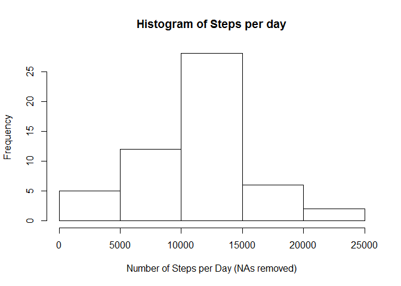
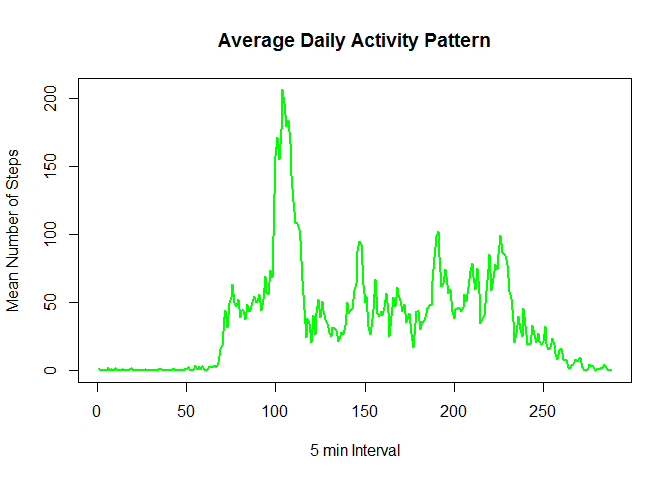
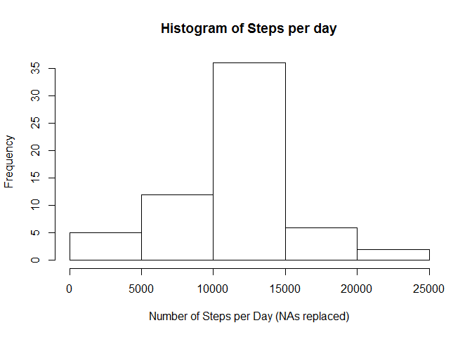
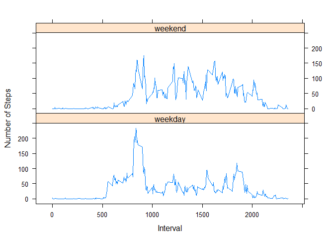

# Reproducible Research: Peer Assessment 1


## Loading and preprocessing the data
Load the Data:

```r
unzip("activity.zip")
activity <- read.csv("activity.csv", header = TRUE)
```

###Preprocess the data by:
1. Removing NAs
2. Changing the text date to an R date

Determine where the NAs are....Note: NAs are only in $steps

```r
sum(is.na(activity$steps))
```

```
## [1] 2304
```

```r
sum(is.na(activity$date))
```

```
## [1] 0
```

```r
sum(is.na(activity$interval))
```

```
## [1] 0
```
First: get rid of the NAs.

```r
act <- activity[!is.na(activity$steps),]
```
Second: change to date text to a date format.

```r
act$date <- as.Date(act$date)
```

## What is mean total number of steps taken per day?


```r
## total the step by day
daysum <- aggregate(act$steps, list(Date = act$date), sum)
## find the mean steps per day
daysummean <- mean(daysum$x)
## find the median steps per day
daysummed <- median(daysum$x)
## format the median steps for display
daysummeanDisplay <- as.character(round(daysummean,0))
```

#### Mean and Median Steps per day (excluding NAs)
The mean steps in a day is 10766. The median steps in a day is 10765.


###Create a histogram of the steps per day

```r
hist(daysum$x, xlab = "Number of Steps per Day (NAs removed)", main = "Histogram of Steps per day")
```

<!-- -->

## What is the average daily activity pattern?

```r
### Find the mean steps in each time interval
intervalmean <- aggregate(act$steps, list(Interval = act$int), mean)
## Create a plot to display average daily activity pattern
plot(1:length(intervalmean$Interval),intervalmean$x, type = "l", xlab = "5 min Interval",ylab = "Mean Number of Steps", col="green", lwd = "2", main="Average Daily Activity Pattern")
```

<!-- -->


```r
## Determine which interval has the highest activity
highest <- intervalmean[intervalmean$x == max(intervalmean$x),]
```
### Interval with the most steps

The interval 835 has the most steps with 206.1698113 steps on average.

## Imputing missing values
Using all the data now add fromat the date as date and determine where the
NAs are


```r
## create a new dataset with ins
act2 <- data.frame( steps=activity$steps, date=as.Date(activity$date), interval=activity$interval)
## find the NAs
areNAs <- is.na(act2$steps)

## Convert the intervals into text times / turned out to be unnecessary

for(i in 1:dim(act2)[1]) {
  act2$inthrs[i] <- if(nchar(as.character(act2$interval[i] %/% 100))<=1){
    paste0("0",act2$interval[i] %/% 100)
    } else {act2$interval[i] %/% 100}

  act2$intmin[i] <- if(nchar(as.character(act2$interval[i] %% 100))<=1){
    paste0("0",act2$interval[i] %% 100)
    } else {act2$interval[i] %% 100}
}
act2$int <- paste0(act2$inthrs,":",act2$intmin)
act2$inttime <- strptime(act2$int,"%H:%M")
```
This code inserts values into places with NAs

```r
## if the value of steps is currently NA then
##get the average steps for the time interval from the prior calculation
## and put it into steps2, if not then just get the value of steps

for(i in 1:dim(act2)[1]){
  if(areNAs[i]){
    act2$steps2[i] <- intervalmean[intervalmean$Interval == act2$interval[i],]$x
    } else {
    act2$steps2[i] <- act2$steps[i]
    }
  }
```
Here are the calculation and the histagram code

```r
daysum2 <- aggregate(act2$steps2, list(Date = act2$date), sum)
daysummean2 <- mean(daysum2$x)
daysummed2 <- median(daysum2$x)
daysummeanDisplay2 <- as.character(round(daysummean2,0))
daysummedDisplay2  <- as.character(round(daysummed2,0))
```
The mean steps in a day is 10766. The median steps in a day is 10766.

```r
hist(daysum2$x, xlab = "Number of Steps per Day (NAs replaced)",main = "Histogram of Steps per day")
```

<!-- -->
#### Impact of Replacing Missing Values
There were 8 days with 288 missing values for steps (every interval. There were no other missing values. By replacing the missing values with the average steps taken from the remaining same intervals we did not significantly change either measure of central tendency, mean or median.

## Are there differences in activity patterns between weekdays and weekends?

This code identifies the weekends and sumarizes steps in each interval

```r
## identifies the day of the week for each date
daysofweek <- lapply(act$date,weekdays)
## Assigns a factor based on if its a weekend or not
act$weekend <- factor(x <- daysofweek == "Saturday" | daysofweek =="Sunday",levels=c(FALSE,TRUE), labels=c("weekday","weekend"))
## calculates the average steps in a day's intervals by weekend or not
intervalmean2 <- aggregate(act$steps, c(list(Interval = act$interval),list(weekdays=act$weekend)), mean)
```

This code makes the plots to compare the activity on weekdays and weekends

```r
require("lattice")
```

```
## Loading required package: lattice
```

```r
xyplot( x ~ Interval | weekdays, 
        type = "l",
        data = intervalmean2, 
        xlab = "Interval",
        ylab = "Number of Steps",
        layout=c(1,2)        
        )
```

<!-- -->
